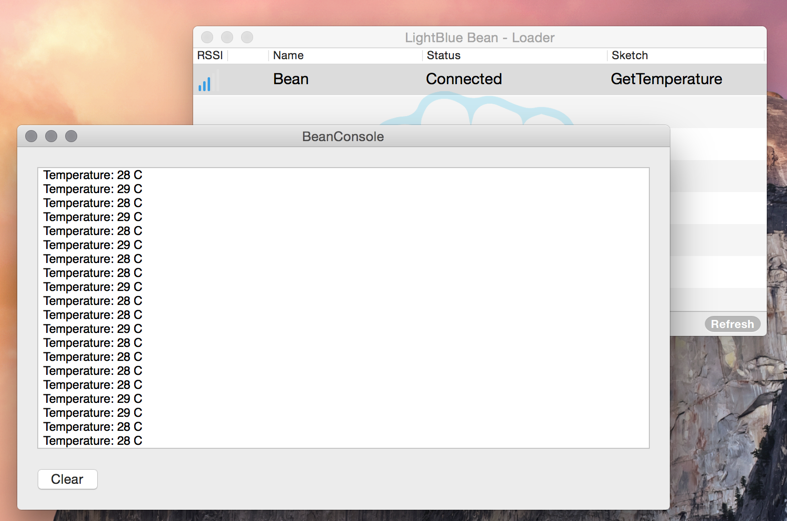

# SemiBeanConsole

This is a Mac OS X desktop app that displays the serial output of all connected LightBlue Beans. This app compliments Punch Through Design's Bean Loader.app for users experiencing beachball issues with the Virtual Serial feature.

## Instructions
1. Connect to a single bean with Bean Loader
2. Run this app

Learn more about PTD's LightBlue Bean at http://punchthrough.com/bean/.
